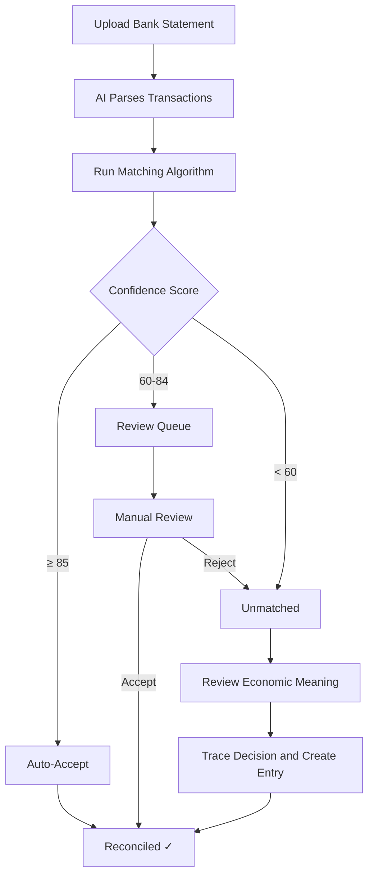
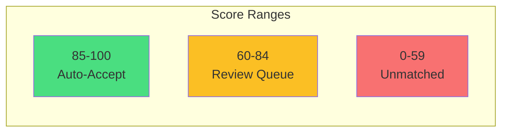

# Bank Reconciliation

Bank reconciliation matches your journal entries with bank statement transactions to ensure accuracy and completeness.

## Why Reconcile?

- ✅ Catch data entry errors
- ✅ Identify missing transactions
- ✅ Detect unauthorized charges
- ✅ Ensure accounting accuracy
- ✅ Prepare for audits

## Reconciliation Flow


```mermaid
flowchart TB
    A[Upload Bank Statement] --> B[AI Parses Transactions]
    B --> C[Run Matching Algorithm]
    C --> D{Confidence Score}
    D -->|≥ 85| E[Auto-Accept]
    D -->|60-84| F[Review Queue]
    D -->|< 60| G[Unmatched]
    E --> H[Reconciled ✓]
    F --> I[Manual Review]
    I -->|Accept| H
    I -->|Reject| G
    G --> J[Review Economic Meaning]
    J --> K[Trace Decision and Create Entry]
    K --> H
```

## Step 1: Upload Bank Statement

### Supported Formats

| Format | Description | AI Parsing |
|--------|-------------|------------|
| **PDF** | Bank statement PDF | ✅ Configured AI provider |
| **CSV** | Exported transactions | ✅ Pattern matching |
| **OFX** | Open Financial Exchange | 🚧 Coming soon |

### Via Web Interface

1. Navigate to **Statements** → **Upload**
2. Select your file
3. Choose the bank account
4. Click **Upload & Parse**

### Via API

```bash
curl -X POST https://report.zitian.party/api/statements/upload \
  -F "file=@statement.pdf" \
  -F "account_id=<bank-account-id>"
```

## Step 2: AI Extraction

The configured AI provider automatically extracts:

- Transaction date
- Description/Payee
- Amount (debit/credit)
- Running balance
- Reference numbers

!!! info "Accuracy"
    AI extraction typically achieves 95%+ accuracy. Always review the extracted data.

### Review Extracted Data

```json
{
  "transactions": [
    {
      "date": "2026-01-05",
      "description": "SALARY DEPOSIT - ACME CORP",
      "amount": 5000.00,
      "type": "credit",
      "balance": 7500.00
    },
    {
      "date": "2026-01-06",
      "description": "WHOLE FOODS #1234",
      "amount": 87.50,
      "type": "debit",
      "balance": 7412.50
    }
  ]
}
```

## Step 3: Run Matching

The reconciliation engine uses multi-dimensional scoring to find matches:

### Scoring Dimensions

| Dimension | Weight | Description |
|-----------|--------|-------------|
| **Amount** | 40% | Exact or near-exact match |
| **Date** | 25% | Same or nearby date |
| **Description** | 20% | Text similarity (fuzzy match) |
| **Business Logic** | 10% | Account type rules |
| **History** | 5% | Historical patterns |

### Confidence Thresholds


```mermaid
graph LR
    subgraph "Score Ranges"
        A[85-100<br/>Auto-Accept]
        B[60-84<br/>Review Queue]
        C[0-59<br/>Unmatched]
    end
    
    style A fill:#4ade80
    style B fill:#fbbf24
    style C fill:#f87171
```

| Score | Action | Example |
|-------|--------|---------|
| **≥ 85** | Auto-accept | Exact amount and date match |
| **60-84** | Review queue | Date differs by a few days |
| **< 60** | Unmatched | No matching entry found |

### Run via API

```bash
curl -X POST https://report.zitian.party/api/reconciliation/runs \
  -H "Content-Type: application/json" \
  -d '{"statement_id": "<statement-id>"}'
```

## Step 4: Review Matches

### View Pending Reviews

```bash
curl https://report.zitian.party/api/reconciliation/pending
```

Response:
```json
{
  "pending_matches": [
    {
      "id": "match-123",
      "bank_transaction": {
        "date": "2026-01-06",
        "description": "WHOLE FOODS #1234",
        "amount": 87.50
      },
      "journal_entry": {
        "date": "2026-01-06",
        "memo": "Groceries - Whole Foods",
        "amount": 87.50
      },
      "score": 78,
      "score_breakdown": {
        "amount": 100,
        "date": 100,
        "description": 45,
        "business": 80,
        "history": 60
      }
    }
  ]
}
```

### Accept or Reject

=== "Accept Match"

    ```bash
    curl -X POST https://report.zitian.party/api/reconciliation/matches/{id}/accept
    ```

=== "Reject Match"

    ```bash
    curl -X POST https://report.zitian.party/api/reconciliation/matches/{id}/reject \
      -d '{"reason": "Wrong transaction"}'
    ```

=== "Batch Accept (Score ≥ 80)"

    ```bash
    curl -X POST https://report.zitian.party/api/reconciliation/batch-accept \
      -d '{"min_score": 80}'
    ```

## Step 5: Handle Unmatched

### View Unmatched Transactions

```bash
curl https://report.zitian.party/api/reconciliation/unmatched
```

### Common Causes

| Cause | Solution |
|-------|----------|
| Missing economic meaning | Review intent, counter account, category, and evidence |
| Wrong date or amount | Correct the source or investigate before posting |
| Fee/interest | Review as an expense or income with the applicable category |
| Duplicate | Void duplicate entry |

### Review and Post an Unmatched Transaction

```bash
# Confirm economic meaning; the server validates disposition and records its trace.
curl -X POST https://report.zitian.party/api/reconciliation/unmatched/{transaction-id}/reviewed-disposition \
  -d '{
    "intent": "expense",
    "counter_account_id": "<fee-expense-id>",
    "category": "BANK_FEES",
    "rationale": "Reviewed against the statement fee description"
  }'
```

Accepting a proposed match never creates an entry or changes its source
provenance. If no reviewed source entry exists, complete this command first.

## Match Types

### One-to-One Match

Most common: one bank transaction matches one journal entry.

```
Bank: $500 paycheck → Entry: $500 salary
```

### One-to-Many Match

One bank transaction matches multiple entries:

```
Bank: $1,000 deposit
  ↓
Entry 1: $600 salary
Entry 2: $400 bonus
```

### Many-to-One Match

Multiple bank transactions match one entry:

```
Bank: $50 coffee
Bank: $30 lunch
Bank: $20 snacks
  ↓
Entry: $100 meals (combined)
```

## Reconciliation Statistics

Track your reconciliation health:

```bash
curl https://report.zitian.party/api/reconciliation/stats
```

```json
{
  "total_transactions": 150,
  "reconciled": 142,
  "pending_review": 5,
  "unmatched": 3,
  "reconciliation_rate": 94.7,
  "average_score": 88.5
}
```

## Best Practices

!!! tip "Reconcile Monthly"
    Reconcile bank statements as soon as they're available.

!!! tip "Start with High Scores"
    Review matches with lower scores more carefully.

!!! tip "Keep Good Memos"
    Descriptive memos improve matching accuracy.

!!! tip "Track Recurring"
    Set up recurring entries for regular transactions.

!!! warning "Don't Ignore Unmatched"
    Unmatched transactions often indicate errors or unauthorized charges.

## Troubleshooting

### Low Match Scores

- Check date accuracy in journal entries
- Improve memo descriptions
- Ensure amounts include fees/taxes

### Parsing Errors

- Verify PDF is not password-protected
- Check statement format is supported
- Contact support for new bank formats

### Duplicate Matches

- Review and reject incorrect matches
- Check for duplicate journal entries

## Next Steps

- [View reconciliation stats](reports.md)
- [API reference](../reference/api.md)
- [Technical details](../../common/reconciliation/readme.md)
