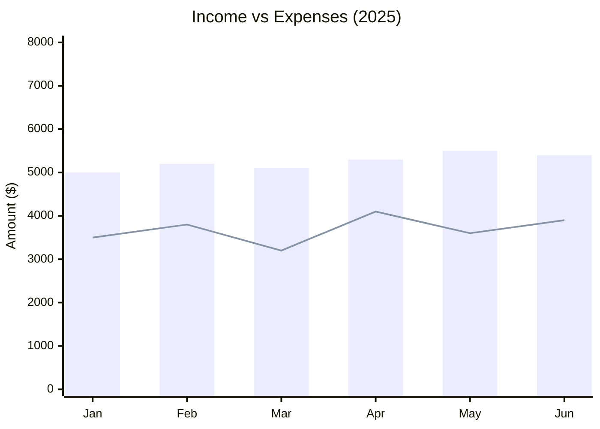
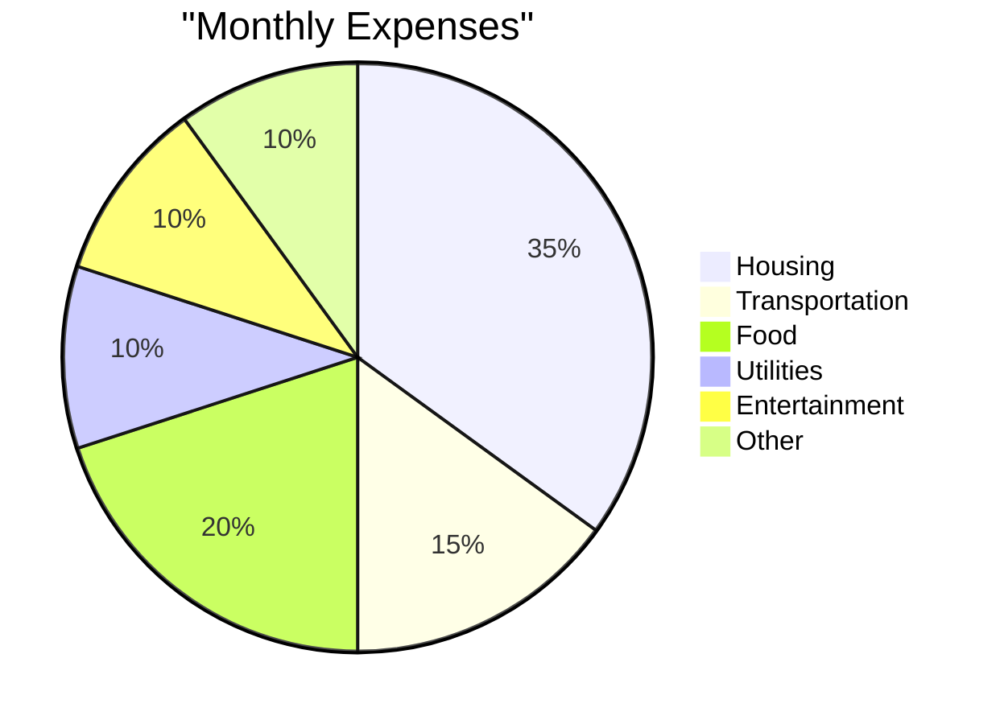

# Reports & Dashboards

Finance Report provides financial reports and dashboards to help you understand your financial position.

!!! note "Coming Soon"
    Full reporting features are being developed in EPIC-005. Current functionality is limited.

## Available Reports

### Balance Sheet

Shows your financial position at a point in time:

```
Assets - Liabilities = Equity
```

| Section | Description |
|---------|-------------|
| **Assets** | What you own (cash, investments, property) |
| **Liabilities** | What you owe (credit cards, loans) |
| **Equity** | Net worth (assets minus liabilities) |

### Income Statement (Profit & Loss)

Shows your income and expenses over a period:

```
Income - Expenses = Net Income
```

| Section | Description |
|---------|-------------|
| **Income** | Money earned (salary, interest, dividends) |
| **Expenses** | Money spent (rent, food, utilities) |
| **Net Income** | Profit or loss for the period |

### Cash Flow Statement

Shows how cash moves in and out:

| Category | Description |
|----------|-------------|
| **Operating** | Day-to-day activities |
| **Investing** | Buying/selling investments |
| **Financing** | Loans, credit cards |

!!! info "Status"
    Cash flow statement is planned for Phase 2.

## Dashboard Widgets

### Account Balances

View current balances for all accounts:

```
┌─────────────────────────────────────┐
│ Account Balances                    │
├─────────────────────────────────────┤
│ Chase Checking     │  $5,234.50    │
│ Savings Account    │ $12,500.00    │
│ Credit Card        │  -$1,234.00   │
│ ─────────────────────────────────── │
│ Net Worth          │ $16,500.50    │
└─────────────────────────────────────┘
```

### Monthly Trends

Track income vs expenses over time:



### Expense Breakdown

See where your money goes:



### Reconciliation Status

Monitor your reconciliation health:

| Metric | Value |
|--------|-------|
| Reconciliation Rate | 94.7% |
| Pending Reviews | 5 |
| Unmatched | 3 |
| Avg Match Score | 88.5 |

## API Endpoints

### Get Account Balances

```bash
curl https://report.zitian.party/api/accounts/balances
```

### Get Balance Sheet

```bash
curl https://report.zitian.party/api/reports/balance-sheet?date=2026-01-10
```

### Get Income Statement

```bash
curl https://report.zitian.party/api/reports/income-statement \
  -d 'start_date=2026-01-01&end_date=2026-01-31'
```

### Get Reconciliation Stats

```bash
curl https://report.zitian.party/api/reconciliation/stats
```

## Export Options

| Format | Description | Status |
|--------|-------------|--------|
| **PDF** | Formatted report | 🚧 Coming |
| **CSV** | Raw data export | 🚧 Coming |
| **JSON** | API response | ✅ Available |

## Customization

### Date Ranges

All reports support custom date ranges:

- Today
- This Week
- This Month
- This Quarter
- This Year
- Custom Range

### Filters

Filter reports by:

- Account type
- Specific accounts
- Categories/Tags
- Amount ranges

## Best Practices

!!! tip "Monthly Review"
    Review your income statement monthly to track spending trends.

!!! tip "Regular Reconciliation"
    High reconciliation rates make reports more accurate.

!!! tip "Year-End Review"
    Generate annual reports for tax preparation.

## Next Steps

- [Set up accounts](accounts.md) for accurate reporting
- [Reconcile transactions](reconciliation.md) for complete data
- [Explore API](../reference/api-overview.md) for custom integrations
