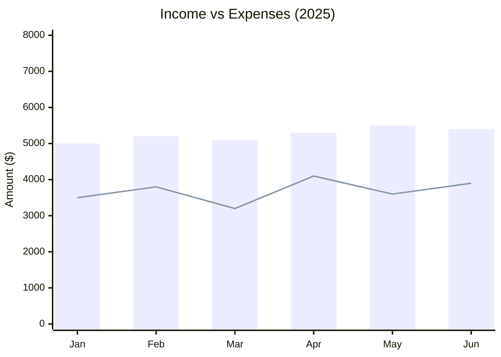
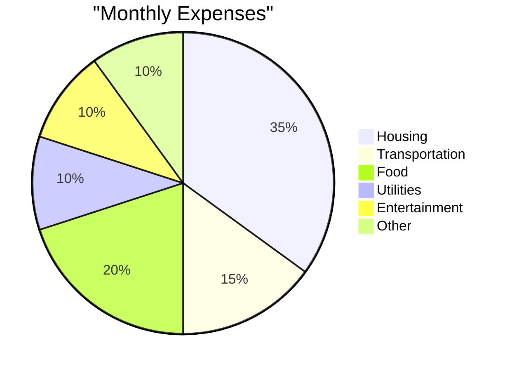

# Reports & Dashboards

Finance Report provides financial reports and dashboards to help you understand your financial position.

Stable report scope is described by
[EPIC-005](../project/EPIC-005.reporting-visualization.md). Current proof
metrics live in CI artifacts and
`python tools/analyze_test_ac_coverage.py --no-write --stdout`.

## Available Reports

### Personal Report Package

The personal financial-report package is one stable document used by preview,
generation, reopen, frontend rendering, and export. Preview it with:

```bash
curl "https://report.zitian.party/api/reports/package?framework_id=personal_us_gaap_like"
```

The document includes balance sheet, income statement, cash flow, investment
performance, annualized income and long-term compensation, notes, traceability,
readiness, framework policy, and its exact decision manifest. Decimal fields
serialize as strings to preserve money precision.

Generate an immutable snapshot with:

```bash
curl -X POST "https://report.zitian.party/api/reports/package/generate" \
  -H "Content-Type: application/json" \
  -d '{"framework_id":"personal_us_gaap_like","start_date":"2026-01-01","end_date":"2026-12-31","as_of_date":"2026-12-31","currency":"SGD","include_restricted":true}'
```

List or reopen only saved documents; reopening never recalculates live data:

```bash
curl "https://report.zitian.party/api/reports/package/snapshots"
curl "https://report.zitian.party/api/reports/package/snapshots/{snapshot_id}"
```

Export that same selected snapshot as JSON or CSV:

```bash
curl "https://report.zitian.party/api/reports/package/snapshots/{snapshot_id}/export?format=json"
curl "https://report.zitian.party/api/reports/package/snapshots/{snapshot_id}/export?format=csv"
```

The embedded traceability appendix maps package lines to exact source and ledger
anchors. Missing, stale, or mismatched decisions keep the preview draft/blocked;
they cannot be upgraded by a source label or by generating an export.

### Balance Sheet

Shows your financial position at a point in time:

```
Assets - Liabilities = Equity
```

| Section | Description |
|---------|-------------|
| **Assets** | What you own (cash, investments, property) |
| **Liabilities** | What you owe (credit cards, loans) |
| **Equity** | Net worth (assets minus liabilities) |

### Income Statement (Profit & Loss)

Shows your income and expenses over a period:

```
Income - Expenses = Net Income
```

| Section | Description |
|---------|-------------|
| **Income** | Money earned (salary, interest, dividends) |
| **Expenses** | Money spent (rent, food, utilities) |
| **Net Income** | Profit or loss for the period |

### Cash Flow Statement

Shows how cash moves in and out:

| Category | Description |
|----------|-------------|
| **Operating** | Day-to-day activities |
| **Investing** | Buying/selling investments |
| **Financing** | Loans, credit cards |

!!! info "Status"
    Cash flow statement is planned for Phase 2.

### Investment Performance

The personal financial-report package includes an `investment_performance`
report section once the EPIC-017 schedule is implemented. The section consumes:

`GET /api/portfolio/performance/report-schedule`

```bash
curl "https://report.zitian.party/api/portfolio/performance/report-schedule?period_start=2026-01-01&period_end=2026-12-31&as_of_date=2026-12-31&currency=SGD"
```

The report section is designed to show XIRR, time-weighted return,
money-weighted return, realized P&L, unrealized P&L, dividend income, dividend
yield, holdings, allocation, data freshness, `source_links`, and `notes`.
Those fields let the package explain how investment-performance values were
calculated and how they trace back to brokerage statements, market prices, and
ledger/report output. `data_freshness.stale_holdings` lists holdings whose price
evidence is older than the requested `as_of_date`.

## Dashboard Widgets

### Account Balances

View current balances for all accounts:

```
┌─────────────────────────────────────┐
│ Account Balances                    │
├─────────────────────────────────────┤
│ Chase Checking     │  $5,234.50    │
│ Savings Account    │ $12,500.00    │
│ Credit Card        │  -$1,234.00   │
│ ─────────────────────────────────── │
│ Net Worth          │ $16,500.50    │
└─────────────────────────────────────┘
```

### Monthly Trends

Track income vs expenses over time:


```mermaid
xychart-beta
    title "Income vs Expenses (2025)"
    x-axis [Jan, Feb, Mar, Apr, May, Jun]
    y-axis "Amount ($)" 0 --> 8000
    bar [5000, 5200, 5100, 5300, 5500, 5400]
    line [3500, 3800, 3200, 4100, 3600, 3900]
```

### Expense Breakdown

See where your money goes:


```mermaid
pie title "Monthly Expenses"
    "Housing" : 35
    "Transportation" : 15
    "Food" : 20
    "Utilities" : 10
    "Entertainment" : 10
    "Other" : 10
```

### Reconciliation Status

Monitor your reconciliation health:

| Metric | Value |
|--------|-------|
| Reconciliation Rate | 94.7% |
| Pending Reviews | 5 |
| Unmatched | 3 |
| Avg Match Score | 88.5 |

## API Endpoints

### Get Account Balances

```bash
curl https://report.zitian.party/api/accounts/balances
```

### Get Balance Sheet

```bash
curl https://report.zitian.party/api/reports/balance-sheet?date=2026-01-10
```

### Get Income Statement

```bash
curl https://report.zitian.party/api/reports/income-statement \
  -d 'start_date=2026-01-01&end_date=2026-01-31'
```

### Get Reconciliation Stats

```bash
curl https://report.zitian.party/api/reconciliation/stats
```

## Export Options

| Format | Description | Status |
|--------|-------------|--------|
| **PDF** | Formatted report | 🚧 Coming |
| **CSV** | Raw data export | 🚧 Coming |
| **JSON** | API response | ✅ Available |

## Customization

### Date Ranges

All reports support custom date ranges:

- Today
- This Week
- This Month
- This Quarter
- This Year
- Custom Range

### Filters

Filter reports by:

- Account type
- Specific accounts
- Categories/Tags
- Amount ranges

## Best Practices

!!! tip "Monthly Review"
    Review your income statement monthly to track spending trends.

!!! tip "Regular Reconciliation"
    High reconciliation rates make reports more accurate.

!!! tip "Year-End Review"
    Generate annual reports for tax preparation.

## Next Steps

- [Set up accounts](accounts.md) for accurate reporting
- [Reconcile transactions](reconciliation.md) for complete data
- [Explore API](../reference/api-overview.md) for custom integrations
